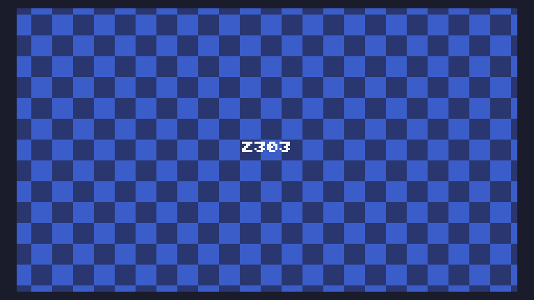

# Day 3 Extended

```
t=0
l=10
h=80
w=240
m=math
r=128
function TIC()
a=t/r
p=m.sin(a)*r
q=m.cos(a)*r
j=(h-l)/2
s=l+j+m.cos(t/h)*j
for i=0,w*136 do
x=i%w
y=i//w
u=(p+x)//s
v=q+y
pix(x,y,8+(u+v/s)%2)
end
print("Z303",108,64,12)
t=t+1
end
```

