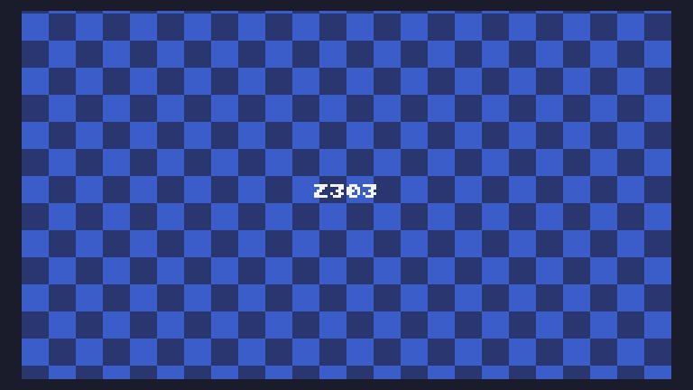

# Day 3

```
t=0
s=10
w=240
function TIC()
for i=0,w*136 do
x=i%w
y=i//w
v=y-t
pix(x,y,8+(x//s+v/s)%2)
end
print("Z303",108,64,12)
t=t+1
end
```

and a formatted version

```
t=0
s=10
w=240
function TIC()
    for i=0,w*136 do
        x=i%w
        y=i//w
        v=y-t
        pix(x,y,8+(x//s+v/s)%2)
    end
    print("Z303",108,64,12)
    t=t+1
end