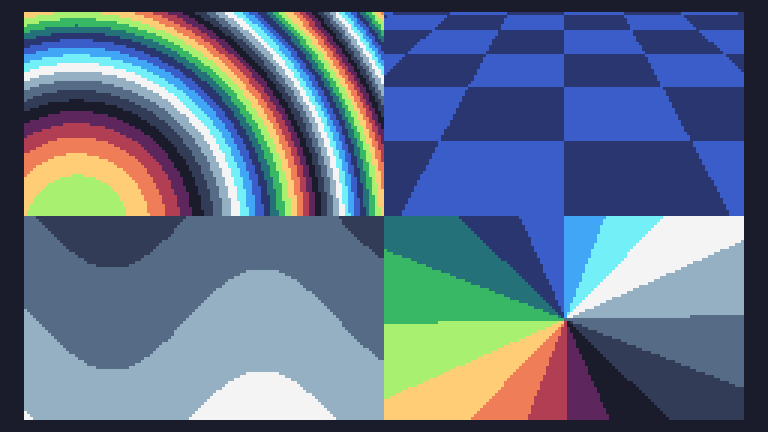

# Day 7

```
m=math
e=m.sin
p=pix
t=0
w=120
h=68
r=99
function TIC()for i=0,w*h-1 do
x=i%w
y=i//w
z=y/w+.3n=x-60q=t/16p(x+w,y,8+(n/z//64+y/z/16-q)%2)p(x,y,r*e(t/h+x/w)+r*e(t/r+y/w))p(x+w,y+h,q+(m.atan2(y-h/2,n)+m.pi)*2.546)p(x,y+h,15+(17*e(x/16+q)-y)/34)end
t=t+1
end
```