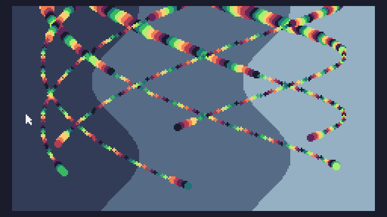

# Day 8

```
m=math
s=m.sin
p=pix
t=0
w=240
q=16
z=100
function TIC()f=t*0.025
for i=0,32639 do
x=i%w
y=i//w
j=p(x,y)
if j<8 then
j=(j+1)%8
end
p(x,y-1,j) 
p(x,y,q+(q*s((y+t)/q)-32-x)/z)
end
for i=1,6 do
a=i-f
b=4*s(a)circ(120+z*s(a-11),z+5*b,4+s(f)*3,4+b)end
t=t+1
end
```

and with some formatting

```
m=math
s=m.sin
p=pix
t=0
w=240
q=16
z=100
function TIC()
    f=t*0.025
    for i=0,32639 do
        x=i%w
        y=i//w
        j=p(x,y)
        if j<8 then
            j=(j+1)%8
        end
        p(x,y-1,j) 
        p(x,y,q+(q*s((y+t)/q)-32-x)/z)
    end
    for i=1,6 do
        a=i-f
        b=4*s(a)circ(120+z*s(a-11),z+5*b,4+s(f)*3,4+b)
    end
    t=t+1
end
```